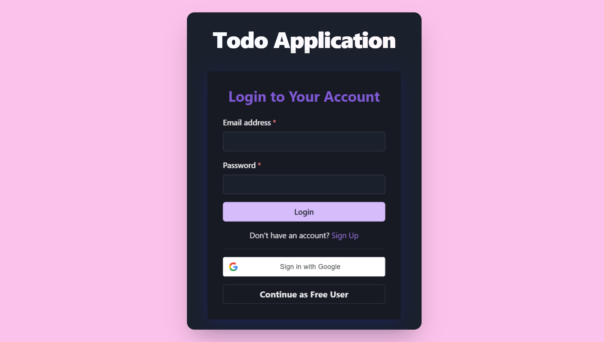
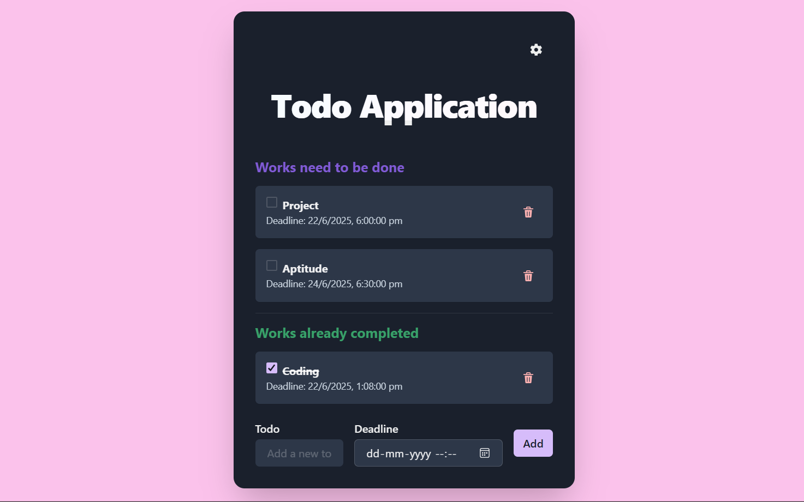

# Todo List App

A modern, responsive Todo List application built with React and Chakra UI.  
Features include authentication, profile management, deadline reminders, and email notifications using EmailJS.

---

## 🚀 Features

- Add, complete, and delete todos
- User authentication (with free user option)
- Profile page with user info
- Light/Dark theme toggle
- Animated background with particles
- **Email notifications** for todos nearing their deadline (via EmailJS)
- Responsive and mobile-friendly UI

---

## 📸 Screenshots

### Login Page


### Todo Page



---

## 🛠️ Getting Started

### 1. Clone the repository

```sh
git clone https://github.com/LakshmiKandakumar/todoapp
cd todo-list-app
```

### 2. Install dependencies

```sh
npm install
```

### 3. Configure EmailJS

- Sign up at [EmailJS](https://www.emailjs.com/)
- Create an email service (e.g., Gmail)
- Create an email template with variables: `{{to_email}}`, `{{todo_content}}`, `{{todo_deadline}}`
- Get your **Service ID**, **Template ID**, and **Public Key**
- Update these values in `src/App.js` in the `sendDeadlineEmail` function

### 4. Start the development server

```sh
npm start
```

The app will run at [http://localhost:3000](http://localhost:3000).

---

## 🌈 Deployment

You can deploy this app easily to [Vercel](https://vercel.com/), [Netlify](https://netlify.com/), or [GitHub Pages](https://pages.github.com/).

### Example: Deploy to Netlify

1.Go to https://netlify.com/ and sign up.
2.Click "Add new site" > "Import an existing project".
3.Connect your GitHub repo.
4.Netlify auto-detects React and sets the build command to npm run build and publish directory to build.
5.Click Deploy Site  
4. Your app will be live at `https://your-app-name.netlify.app`.

---

## 📁 Project Structure

```
src/
  components/
    AddTodo.js
    AuthPage.js
    ProfilePage.js
    TodoList.js
  App.js
  App.css
  index.js
```

---

## ⚙️ Customization

- **Gradient Background:**  
  Easily change the background gradient in `App.js` via the `background` style property.
- **Theme:**  
  Toggle between light and dark modes using the settings menu.
- **Email Notifications:**  
  Edit the email template in your EmailJS dashboard for custom notification content.

---

## 📝 License

MIT

---

## 🙏 Credits

- [React](https://reactjs.org/)
- [Chakra UI](https://chakra-ui.com/)
- [EmailJS](https://www.emailjs.com/)
- [react-tsparticles](https://github.com/matteobruni/tsparticles)

---

**Made with ❤️ by lakshmi.k
